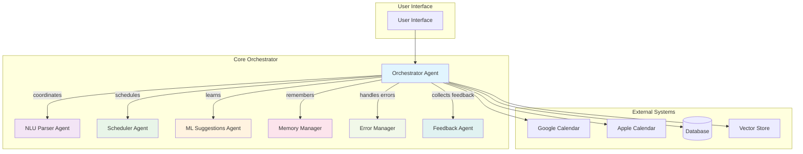
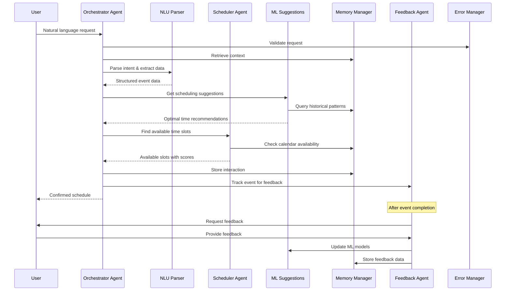
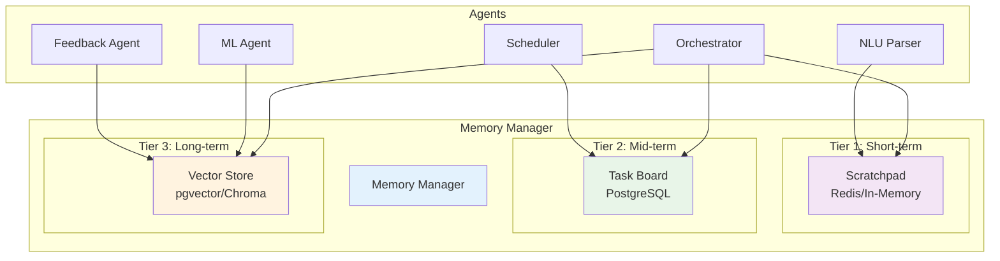
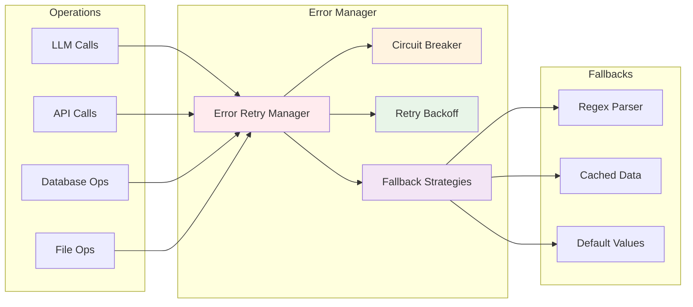
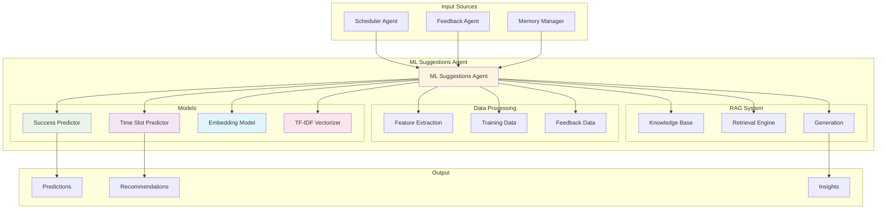
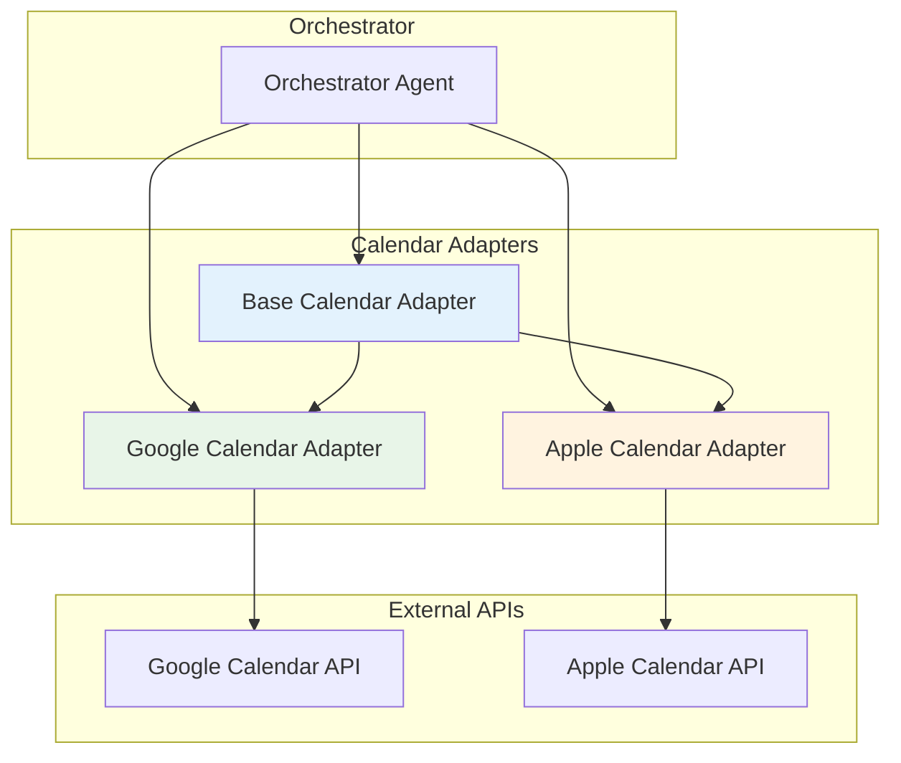
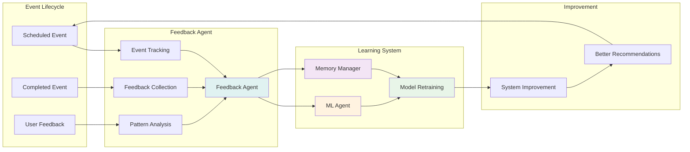
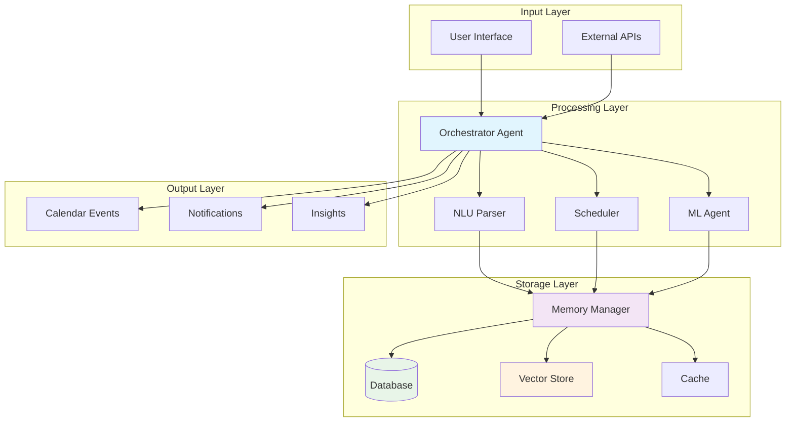
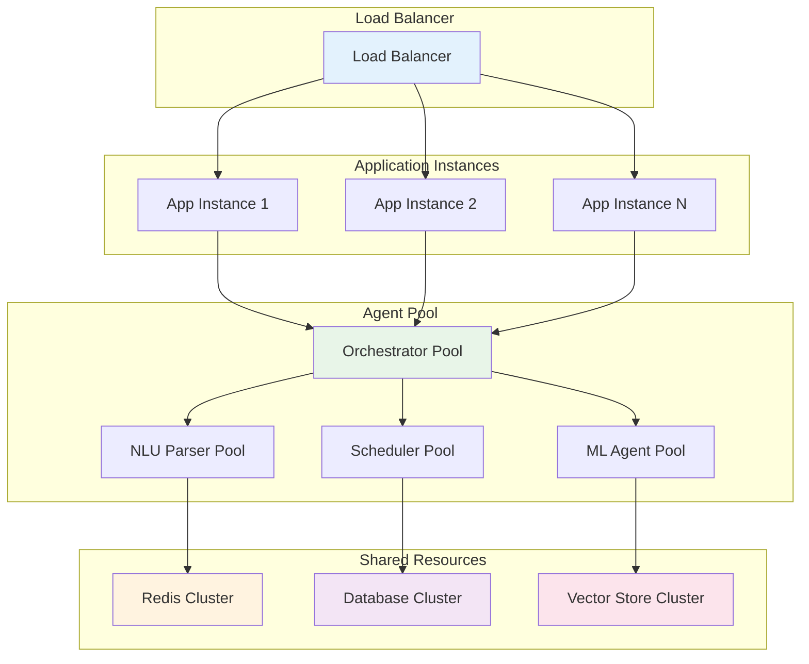

# Calendar Agent Architecture Visualization

## System Overview

This document provides visual representations of the multi-agent calendar system architecture, showing the relationships between specialized agents, data flow, and system components.

## 1. High-Level Architecture

## 2. Agent Communication Flow

## 3. Memory System Architecture

## 4. Error Handling & Resilience

## 5. ML Suggestions Pipeline

## 6. Calendar Adapter System

## 7. Feedback Learning Loop

## 8. Data Flow Architecture

## 9. Agent Responsibilities Matrix

| Agent              | Primary Responsibility         | Key Capabilities                                                | Dependencies                  |
| ------------------ | ------------------------------ | --------------------------------------------------------------- | ----------------------------- |
| **Orchestrator**   | System coordination            | Task decomposition, agent routing, decision making              | All other agents              |
| **NLU Parser**     | Natural language understanding | Intent extraction, data parsing, ambiguity resolution           | LLM services                  |
| **Scheduler**      | Time slot optimization         | Availability checking, conflict resolution, preference matching | Calendar adapters, ML agent   |
| **ML Suggestions** | Predictive analytics           | Success prediction, time slot recommendations, pattern learning | Memory manager, training data |
| **Memory Manager** | Multi-tier storage             | Context management, historical data, vector search              | Database, vector store        |
| **Feedback Agent** | Learning loop                  | Event tracking, feedback collection, pattern analysis           | ML agent, memory manager      |
| **Error Manager**  | Resilience                     | Retry logic, fallback strategies, circuit breakers              | All external services         |

## 10. System Scalability Architecture

## Key Architectural Principles

1. **Separation of Concerns**: Each agent has a specific, well-defined responsibility
2. **Loose Coupling**: Agents communicate through standardized message interfaces
3. **Fault Tolerance**: Error manager provides resilience and fallback strategies
4. **Scalability**: Agent pools and shared resources enable horizontal scaling
5. **Learning Loop**: Feedback system continuously improves recommendations
6. **Multi-tier Memory**: Short, mid, and long-term memory for different use cases
7. **Extensible Adapters**: Calendar adapters can be easily added for new providers

This architecture enables a robust, scalable, and intelligent calendar management system that can handle complex scheduling scenarios while continuously learning and improving from user interactions.
